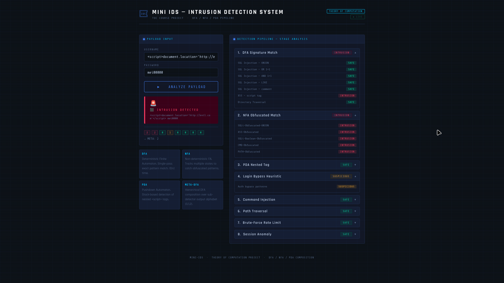
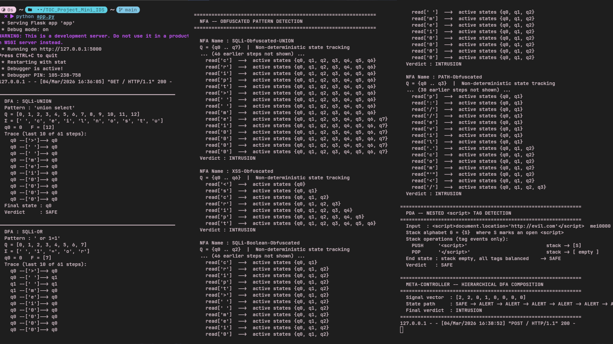

# **Mini IDS using Automata**
## OverView


## Course
Theory of Computation

## Contributors
- [Meijeevan K.T](https://github.com/MEIJEEVAN)
- [Shanmuka Priyan V](https://github.com/ShanmukaPriyan-V2025)
- [Muhilan S R](https://github.com/muhil26)

## Automata Types
- NFA (Nondeterministic Finite Automaton)
- DFA (Deterministic Finite Automaton)
- PDA (Pushdown Automaton)

## Tech Stack


## Project Overview
This project implements a Mini Intrusion Detection System (IDS) using various types of automata. It aims to detect abnormal patterns in network traffic and identify potential security threats. The system can classify different types of attacks based on predefined rules and patterns.

## Project Structure
```
Mini_IDS/
├── app.py
├── automata
│   ├── dfa.py
│   ├── __init__.py
│   ├── nfa.py
│   └── pda.py
├── detection
│   ├── bruteforce.py
│   ├── command_injection.py
│   ├── __init__.py
│   ├── login_bypass.py
│   ├── meta_controller.py
│   ├── path_traversal.py
│   ├── port_scan.py
│   ├── session_behavior.py
│   └── supervisor.py
├── detectors
│   ├── dfa_alerts.py
│   ├── __init__.py
│   ├── nfa_alerts.py
│   └── pda_alerts.py
├── docs
├── main.py
├── README.md
├── requirements.txt
└── templates
    └── login.html
```
---

### Prerequisites

- Python 3.8+
- pip

### Installation

```bash
git clone https://github.com/MEIJEEVAN/TOC_Project_Mini_IDS.git
cd TOC_Project_Mini_IDS
pip install -r requirements.txt
```

### Running the Web App

```bash
python app.py
```

Then open your browser and navigate to `http://localhost:5000`.

### Running Detectors Directly

```bash
python main.py or sudo venv/bin/python main.py
```
---

## TOC Concepts Applied

- **Finite Automata (DFA/NFA)** — each detector models attack patterns as state machines
- **Regular Languages** — attack signatures expressed as regular expressions / automata transitions
- **Formal Language Theory** — inputs are treated as strings over an alphabet, accepted or rejected by automata

---

## Attack Patterns Detected
| Attack | File | Description |
|---|---|---|
| Brute Force | `bruteforce.py` | Repeated failed login attempts |
| Command Injection | `command_injection.py` | Malicious shell commands in inputs |
| Login Bypass | `login_bypass.py` | SQL/logic-based authentication bypass |
| Path Traversal | `path_traversal.py` | Directory traversal (`../`) attempts |
| Port Scan | `port_scan.py` | Sequential port probing behavior |
| Session Hijacking | `session_behavior.py` | Anomalous session token/cookie behavior |

---

## Architecture

```
User Input / HTTP Request
        │
        ▼
   [ app.py ]  ←── Flask Web Interface
        │
        ▼
  [ main.py ]  ←── Entry point / orchestrator
        │
        ▼
[ meta_controller.py ] ←── Coordinates all detectors
        │
        ▼
[ supervisor.py ] ←── Final alert decision logic
        │
   ┌────┴─────┬──────────┬────────────┐
   ▼          ▼          ▼            ▼
bruteforce  cmd_inj  path_trav   (etc.)
        │
        ▼
  [ automata/ ] ←── DFA/NFA definitions
```

---

## License

This project was developed as an academic project for a Theory of Computation course. Feel free to use it for learning purposes.

---
_Last updated: 2026-03-04 07:40:15 UTC_
